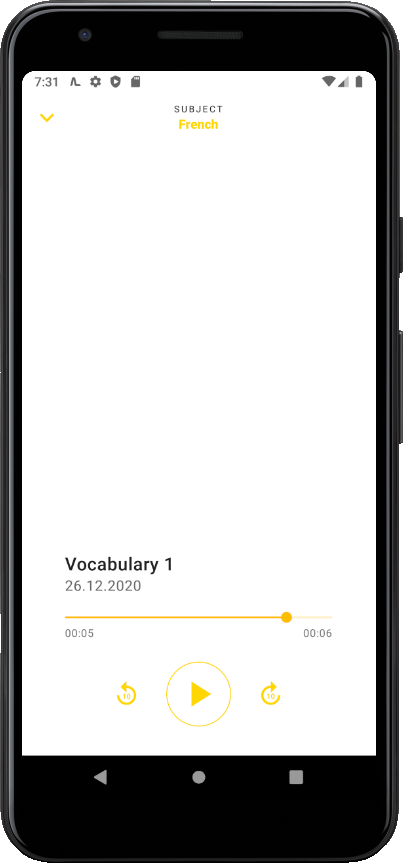

# 

This is the official source code of the AudioLearning Android App. In the following are explanations ranging from What this app actually is, which technologies were used and so on.

## What this app is
The **AudioLearning App** was meant to be an educational app. The principle behind it was *recording your school contents* (such as vocabulary, exam preparations, etc.) and then be able to *rehear it like hearing music*. In addition there would be features like *playing calming music* in the background of the recordings to better clear the noise of the outer world.

## Used technologies
On the Android side we have the following technologies:
* Kotlin + Coroutines
* Dependency Injection with Dagger Hilt
* Android Navigation
* Android Room
* Android ViewModel
* Android Exoplayer
* Google Material Design

For testing we used:
* jUnit 4
* Robolectric
* Espresso
* Mockito
* Timber

CI / CD:
* CircleCi
* BitRise
* Git + Github (obviously)

Miscellaneous:
* Android Studio for development
* Adobe XD for UI / UX Design
* Slack for team communication
* Notion for project management

## Screen shots
| Home Screen      | Subjects Screen    |
| ---------------- | ----------------- |
|     |  |
|  |  |

| Recordings Screen   | Audio Player |
| ------------------- | ------------ |
|  |  |

## Why this project is terminated
**TL;DR** - We did not work lean enough, we were beaten by a competitor. 

We wanted to enter the market with a perfect app, not going the lean way. After one year of development we did not have any user feedback or such. We worked to long on small details instead of focusing on the most important things. At the end we found out that an app with pretty exactly the same features we would have started in the DACH-Region. They even had half-a-million funding. So we terminated the project. 

At this point I want to thank my teammates [Jan](http://janmeuser.com/) and Kara. Eventough we never came to finish this project, it was still an important learning experience.

## Finishing information
This project is for showcasing purposes only. Please [contact](mailto:me@johnlouisjacobs.de) me if you ever want to use parts of this project.